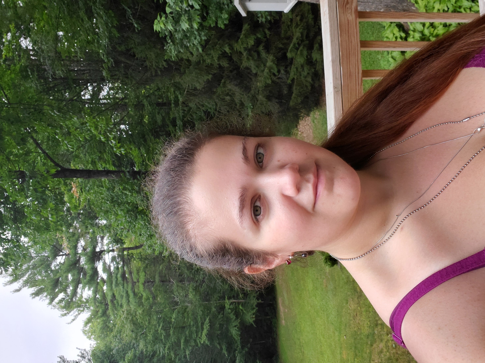

```
title: "About Me"

```


**Education**

I have two undergraduate degrees. My first is an associates of science in Life Science from Manchester Community College and the second is a bachelors of science in marine, estuarine, and freshwater biology from the University of New Hampshire. My specialized courses in my bachelors were focused on marine systems. I am currently a masters student in marine biology at the University of New Hampshire. Come fall 2022 I will be transferring into the doctoral program in marine biology.


**Research Interests**

My research interests lie in marine conservation, marine ecology, ocean warming, ocean acidification, and invasive species. In these areas I am focused more on invertebrates than vertebrates. I am also interested in mathematical modeling and how it can help us with predicting the future of the ocean. My current graduate work is focusing on many of these areas.


**Personal**

I am married with a child and enjoy being outdoors, reading, and playing dungeons and dragons in which I do a lot of creative writing. I have a dog, two cats and a 30 gallon fish tank. See the "Zoo" tab to see all my critters!

