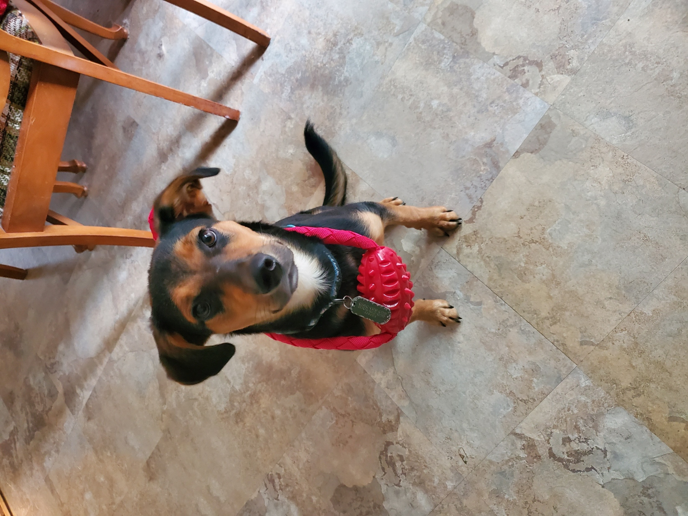
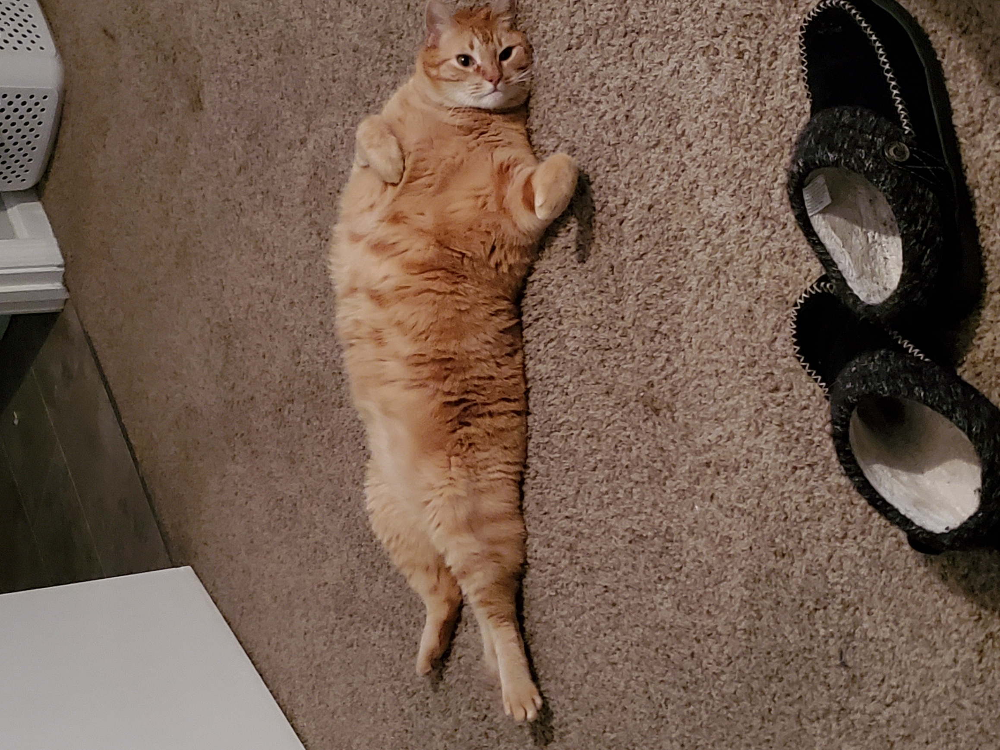
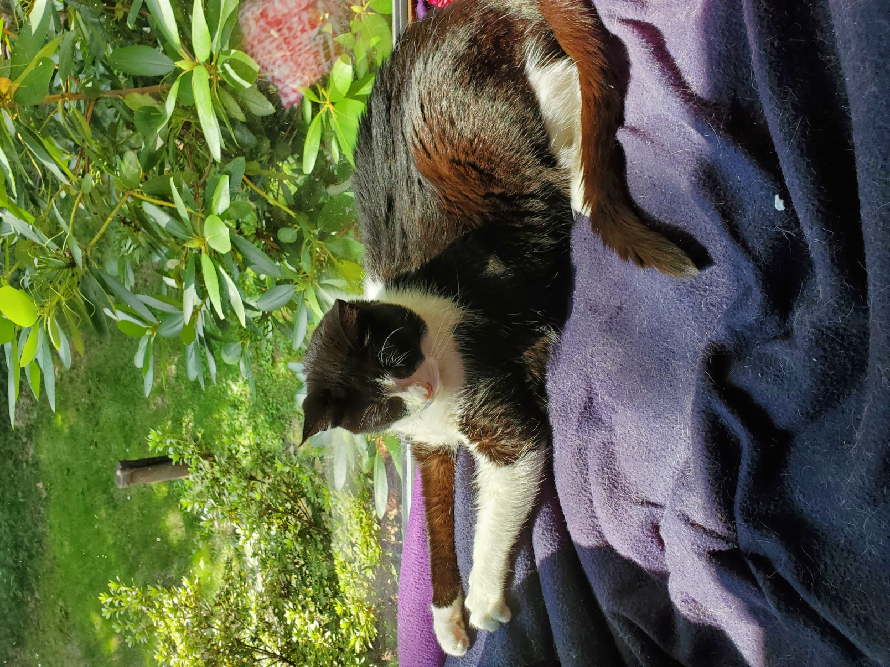
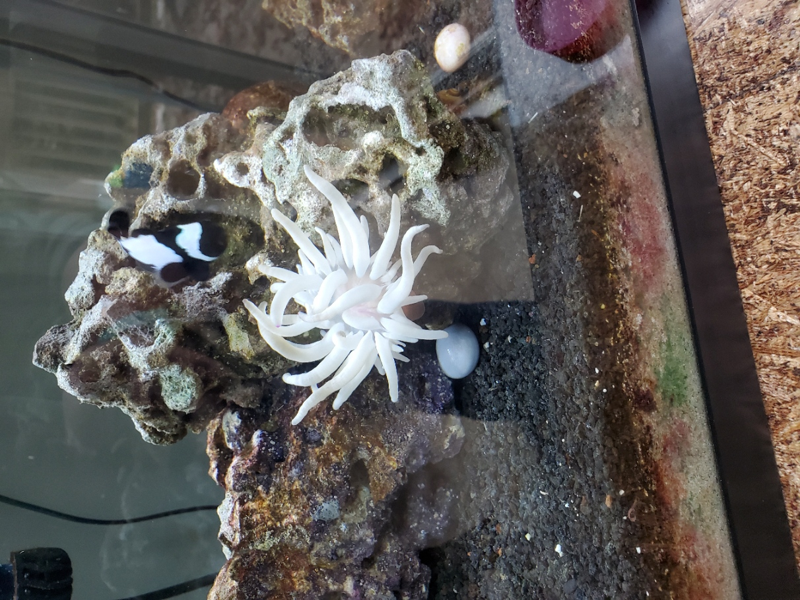
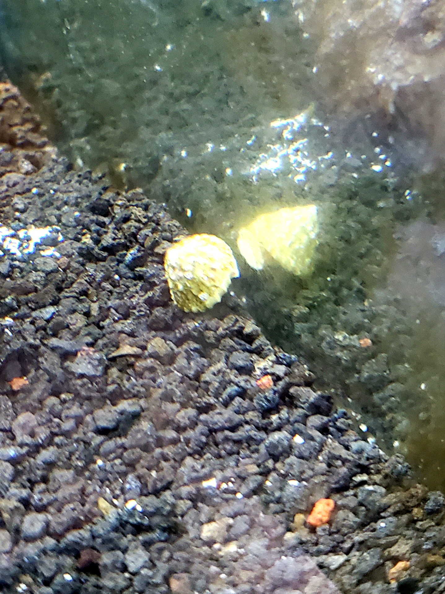
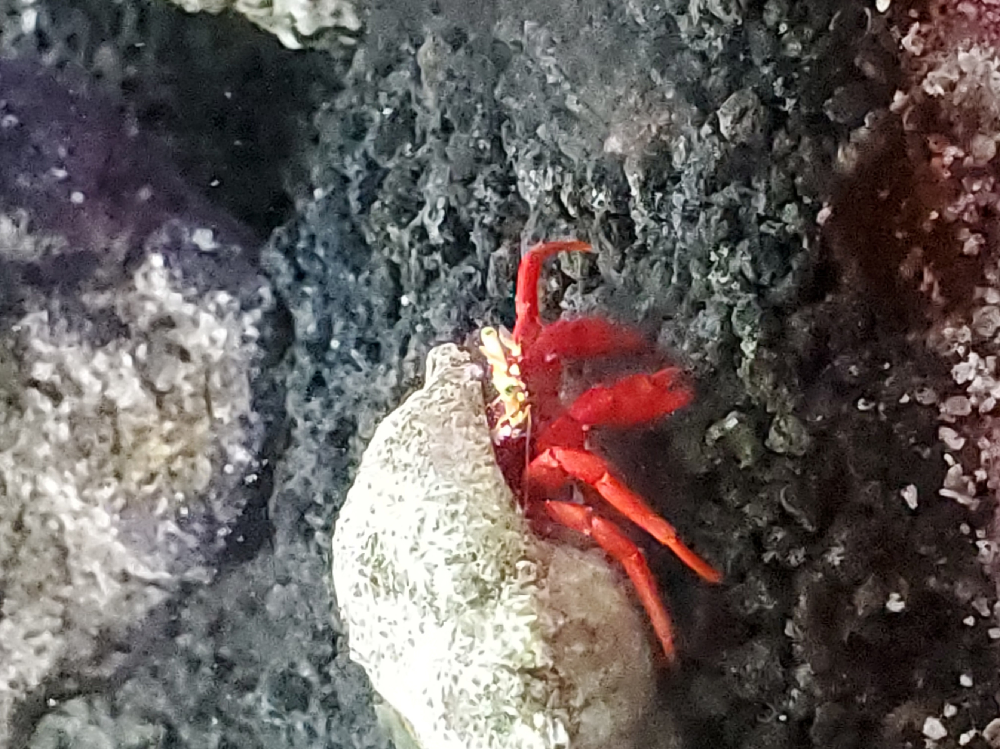
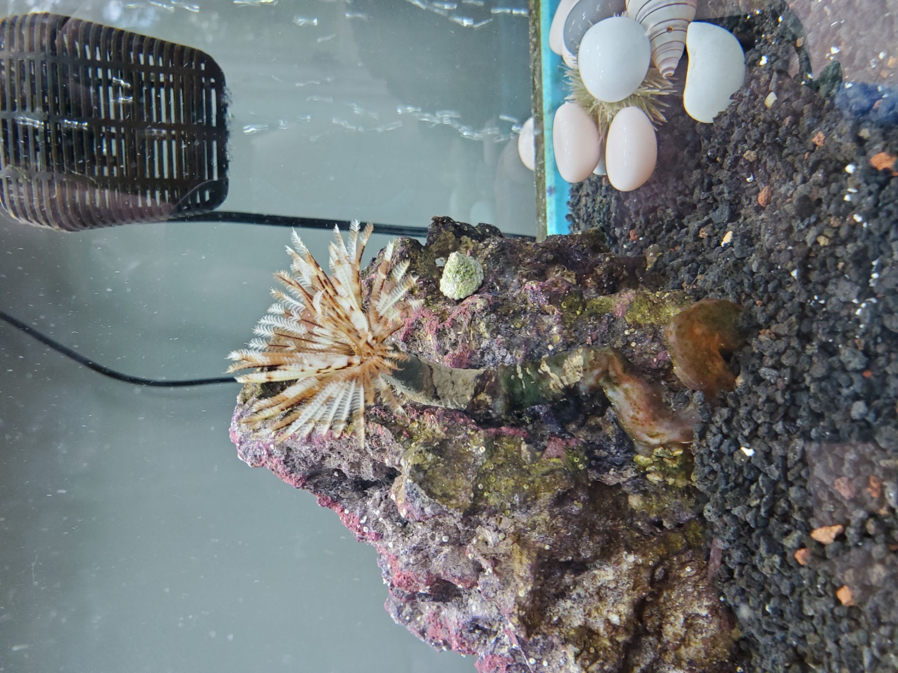
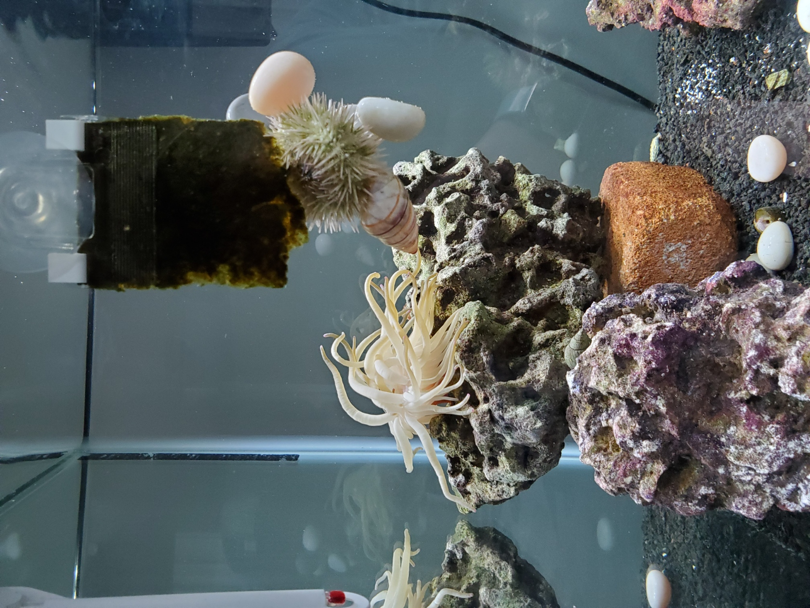

```
tite: "My Zoo at Home"

```

**Kenny- Shepard/Hound Mix**




**Jack (top) and Afaya (bottom)**






**The Disney Reef!**


**Note I do not know the actual sexes of the marine animals we just call them by their name. We choose their name by personality.**


**Rafiki- Black Ice Clownfish (and his bonded anemone)**


**Mister Anemone- Haitian Sea Anemone (aka Pink Tipped Condy)**




**Tinker Bell- Royal Gramma (Fairy) Basslet**

Picture to come (she is camera shy)


**Cogsworth(s)- Astrea Snails (multiple)**




**Sebastian- Red Legged Cortez Hermit Crab**




**Plumette- Feather Duster Worm**




**Bristle Worms- an unknown inhabitant but very beneficial!!**


**Tamatoa- Pincushion Sea Urchin (of course!!!)**

